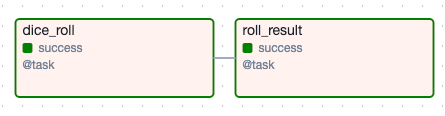
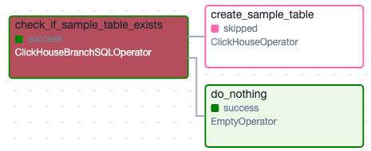
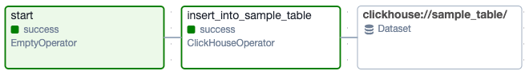
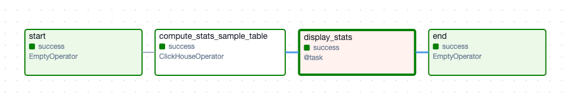
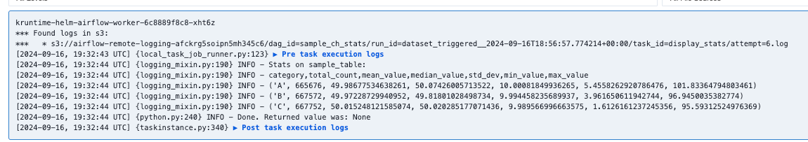

# sample-airflow-dags
Example dags for DobuleCloud Managed Airflow, showcasing interaction with other DC services

Refer to documentation for Getting Started guide: https://double.cloud/docs/en/managed-airflow/get-started

## ClickHouse connection

You would need a ClickHouse connection named `ch_default` to make DAGs with tag `clickhouse` connect to your ClickHouse instance.
If using DoubleCloud ClickHouse, create a generic connection with extra setting `{"secure": true}`. 

## DAGs

[roll_d20](./dags/roll_d20.py) is not connected to anything and can be used to check new setup. Once enabled, it runs on a cron schedule every 5 minutes. You can set env variable `RND_SEED_OVERRIDE` in DC Airflow cluster settings to specify custom random seed for reproducibility.

---

[sample_ch_ddl](./dags/sample_ch_ddl.py) checks if `sample_table` exists in clickhouse connection with connection_id `ch_default`.

---

[sample_ch_insert](./dags/sample_ch_insert.py) inserts specified number of rows in `sample_table` and updates dataset `clickhouse://sample_table`.

---

[sample_ch_stats](./dags/sample_ch_stats.py) computes stats on `sample_table` and outputs them in task logs. Triggered on updates in dataset `clickhouse://sample_table`

